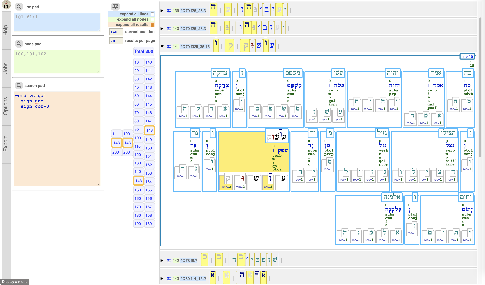

# Dead Sea Scrolls

[ Software Heritage Archive](https://archive.softwareheritage.org/browse/origin/https://github.com/annotation/app-dss/)

This is a
[Text-Fabric](https://githubv.com/annotation/text-fabric) app
for working with
[Dead Sea Scrolls](https://github.com/etcbc/dss): Biblical and non-biblical scrolls found
in Qumran near the Dead Sea.

Get started with the
[tutorial](https://nbviewer.jupyter.org/github/annotation/tutorials/blob/master/dss/start.ipynb).

It offers this [API](https://annotation.github.io/text-fabric/Api/App/).

See also
[about](https://github.com/etcbc/dss/blob/master/docs/about.md),
[transcription](https://github.com/etcbc/dss/blob/master/docs/transcription.md).

